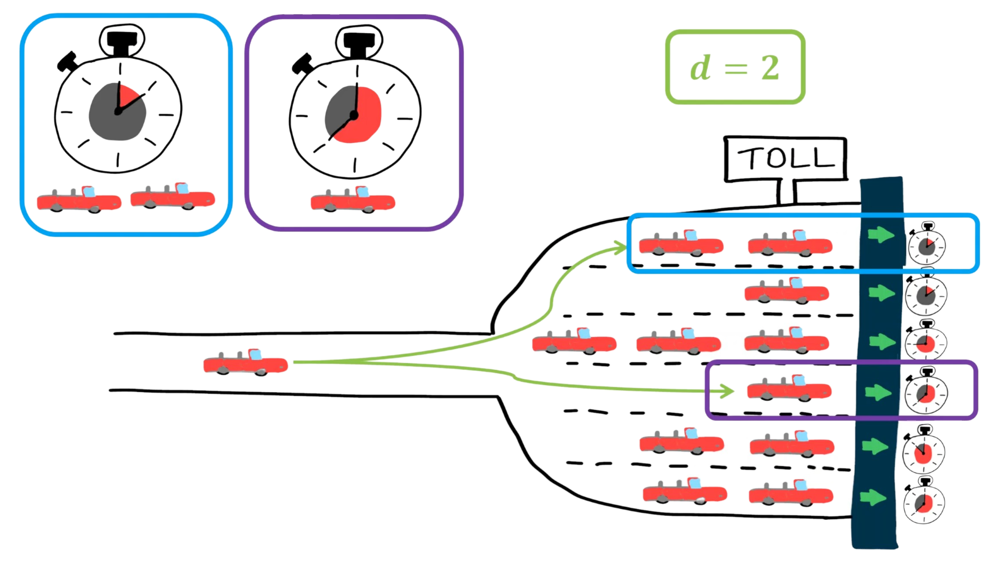

## Biography

 I am currently wrapping up my Phd in computer science at the University of Antwerp. I have been using *mean field methods* to analyze *load balancing policies* in systems with many servers. 
My Phd mainly required a lot of *probability theory* (in particular Markov chain theory), *calculus* and *programming*.
Before starting my Phd I graduated *summa cum laude* in mathematics at the University of Antwerp.
During my Phd I have come into contact with quite a few optimization and forecasting problems. I am currently on the lookout to start working as a *data scientist*.
I published 8 independent papers (6 as first author) which can be viewed on my [Google Scholar](https://scholar.google.com/citations?user=mrMXW1EAAAAJ&hl=en&oi=sra).
In particular I have been accepted for the [Sigmetrics Conference](https://en.wikipedia.org/wiki/SIGMETRICS#2020) three times, this is significant as the Sigmetrics conference may be seen as the flagship conference for my area of research. From Wikipedia: 

>It is also the name of an annual 'flagship' conference, organized by SIGMETRICS since 1973, which is considered to be the leading conference in performance analysis and modeling in the world. Known to have an extremely low acceptance rate (~15%), many of the landmark works in the area have been published through it.

## Interests

 1. Probability theory
 2. Statistics
 3. Mathematics
 4. Python
 5. Matlab
 6. (Discrete) optimization
 7. Data Science
 8. Machine Learning
 9. Scheduling problems
 10. Routing problems

## Open source projects

## [Thesis, Analysis of Large Scale Randomized Load Balancing Policies](https://github.com/THellemans/Thesis-Analysis-of-Large-Scale-Randomized-Load-Balancing-Policies)

Markov processes have found widespread use in the analysis of computer systems and beyond. Over time the size of the systems under consideration has grown considerably, e.g. Google has hundreds
of thousands of servers located in its various data centers. This growth in the system size has made
conventional methods to analyse these Markov processes infeasible.

As such, deterministic approximations, also known as mean field or fluid models, have been
introduced to analyse such large scale systems. Interestingly, these deterministic models have been
shown to correspond to the limit of a sequence of appropriately scaled Markov processes showing
that the systems behaviour becomes deterministic as the system size tends to infinity.
These Markov processes typically have a countable state space and the limiting system is described
by a set of ordinary differential equations.

However, in order to analyse large scale computer
systems with general job size distributions, one needs to keep track of the age or residual service
time of each job. This makes the state space uncountable and the natural candidate for the limiting
system becomes a set of partial differential equations (PDEs).

In this thesis, we initiated the analysis of workload dependent load balancing policies. For these policies, the aforementioned PDEs can be reduced to a single integro differential equation or to ordinary differential equations. Therefore, these policies are relatively easy to study for general job sizes. We found that many existing policies fall into the category of workload dependent policies. Besides obtaining numerical methods to analyse these load balancing policies, we additionally prove many analytical results for these type of models.

In addition, we recognized that studying the more *classic* queue length dependent load balancing policies for general job sizes is indeed difficult. However, if one restricts to phase type job sizes (which are dense in the set of all probability distributions) the analysis simplifies significantly. Furthermore, we introduce and analyse a set of policies which take both the queue length and the age of the job currently receiving service into account.

The image we started with may be seen as an example of a problem setting we analysed. There are multiple queues (here queues are represented by toll gates) at which jobs (in this case cars) arrive. For each queue we know two things: 
 - The number of cars waiting to receive service.
 - The amount of service received by the job at the head of the queue.

At each arrival instant, the car considers *2* queues and decides which queue it will join based on the provided information. We developped a general method which may be used to analyse load balancing policies which distribute jobs in this context. We found that making use of the age of a job may result in a reduction in waiting time of up to *80%* for jobs which are sufficiently variable (we used a squared coefficient of variation of 10).

## [Vehicle Routing Problem]{https://github.com/THellemans/vehicle_routing_problem}

# Motivation

Discrete optimization is everywhere! The Vehicle Routing Problem (VRP) is a well known optimization problem which (attempts) to answer the question:

> What is the optimal set of routes for a fleet of vehicles to traverse in order to deliver to a given set of customers?

Variations of this question are interesting in many practical applications.

# Running the code

In order to test the code, run `python solver_ALNS.py ./data/vrp_5_4_1` or any other file in the data folder.
