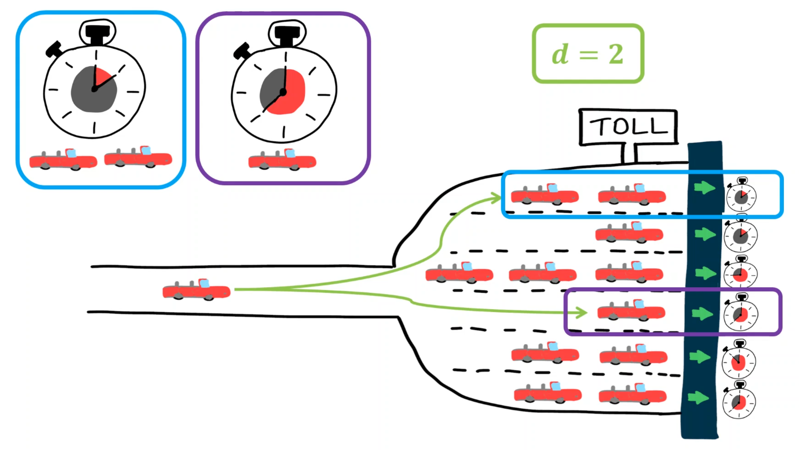

## [Thesis, on the power of d choices](https://github.com/THellemans/Thesis-Power-of-d-Choices)

Markov processes have found widespread use in the analysis of computer systems and beyond. Over time the size of the systems under consideration has grown considerably, e.g. Google has hundreds
of thousands of servers located in its various data centers. This growth in the system size has made
conventional methods to analyse these Markov processes infeasible.

As such, deterministic approximations, also known as mean field or fluid models, have been
introduced to analyse such large scale systems. Interestingly, these deterministic models have been
shown to correspond to the limit of a sequence of appropriately scaled Markov processes showing
that the systems behaviour becomes deterministic as the system size tends to infinity.
These Markov processes typically have a countable state space and the limiting system is described
by a set of ordinary differential equations.

However, in order to analyse large scale computer
systems with general job size distributions, one needs to keep track of the age or residual service
time of each job. This makes the state space uncountable and the natural candidate for the limiting
system becomes a set of partial differential equations (PDEs).

In this thesis, we initiated the analysis of workload dependent load balancing policies. For these policies, the aforementioned PDEs can be reduced to a single integro differential equation or to ordinary differential equations. Therefore, these policies are relatively easy to study for general job sizes. We found that many existing policies fall into the category of workload dependent policies. Besides obtaining numerical methods to analyse these load balancing policies, we additionally prove many analytical results for these type of models.

In addition, we recognized that studying the more *classic* queue length dependent load balancing policies for general job sizes is indeed difficult. However, if one restricts to phase type job sizes (which are dense in the set of all probability distributions) the analysis simplifies significantly. Furthermore, we introduce and analyse a set of policies which take both the queue length and the age of the job currently receiving service into account.

