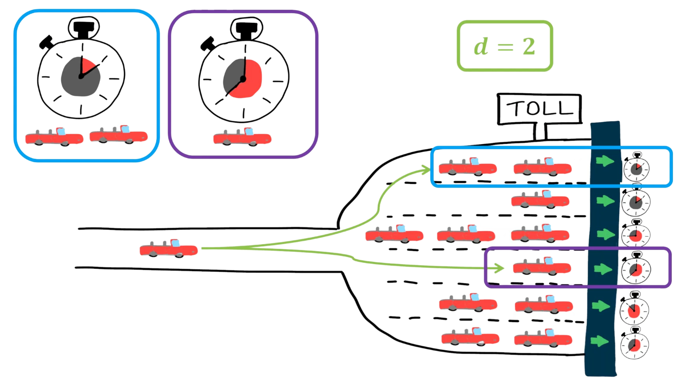
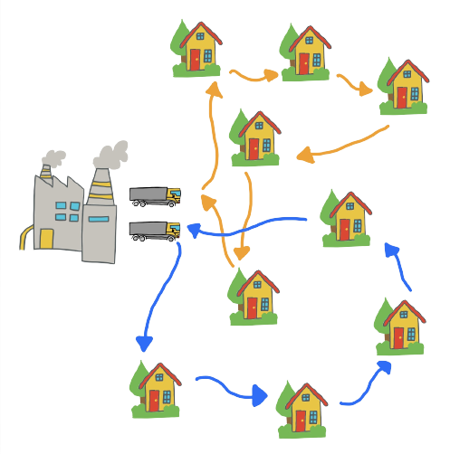
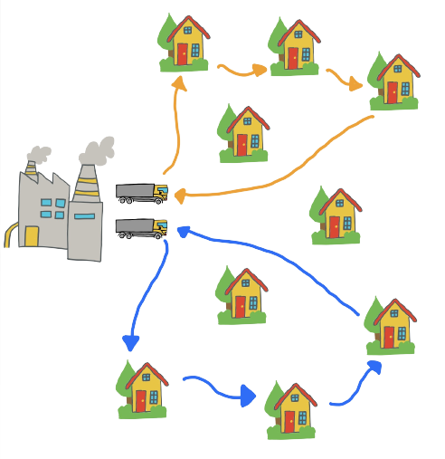
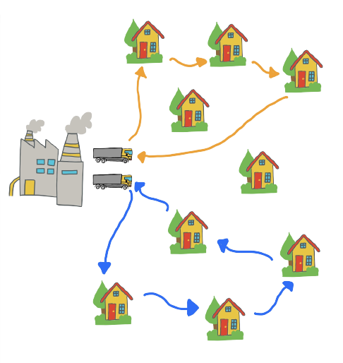
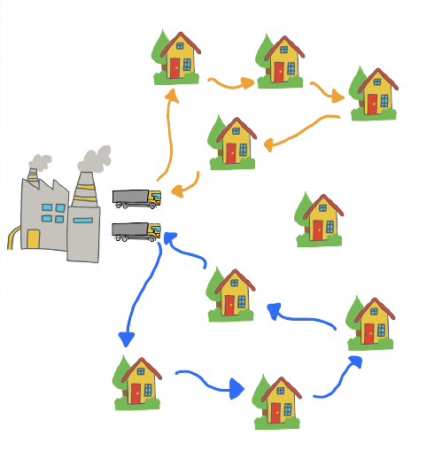
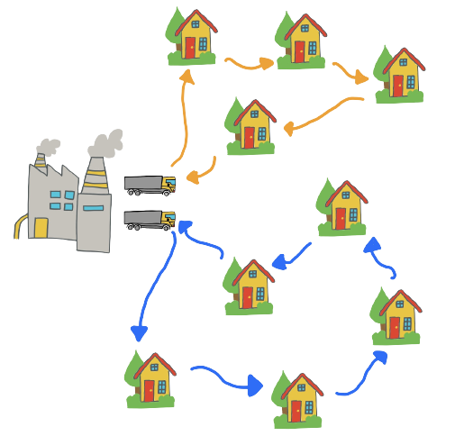
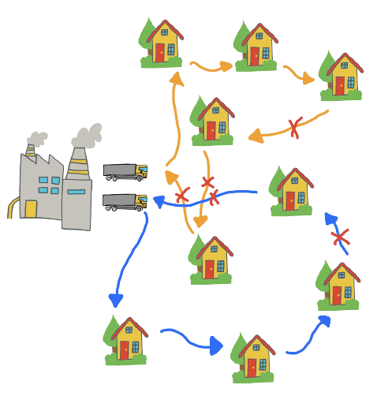

# Biography
  <a href="url"></a>
 I am currently wrapping up my **Phd** in **computer science** at the University of Antwerp which I started after graduating **summa cum laude** in mathematics. I have been using **mean field methods** to analyze **load balancing policies** in systems with many servers. 
My Phd mainly required a lot of **probability theory** (in particular Markov chain theory), **calculus** and **programming**.
During my Phd I have come into contact with quite a few **optimization** and **forecasting** problems. I am currently on the lookout to start working as a **data scientist**.
I published **9** independent papers **(7 as first author)**.
In particular I have been accepted (as first author) for the [**Sigmetrics Conference**](https://en.wikipedia.org/wiki/SIGMETRICS#2020) three times, this is significant as it is the flagship conference for my area of research. From Wikipedia: 

>It is also the name of an annual 'flagship' conference, organized by SIGMETRICS since 1973, which is considered to be the leading conference in performance analysis and modeling in the world. Known to have an extremely low acceptance rate (~15%), many of the landmark works in the area have been published through it.

# Table of Contents

 - [Interests](#interests)
 - [Open source projects](#open-source-projects)
   - [Analysis of Large Scale Randomized Load Balancing Policies](#[analysis-of-large-scale-randomized-load-balancing-policies])
     - [Layman summary](#layman-summary)
     - [List of publications](#list-of-publications)
 - [Capacitated Vehicle Routing Problem](#capacitated-vehicle-routing-problem)
   - [Motivation](#motivation)
   - [Formulation of the problem](#formulation-of-the-problem)
   - [Why Adaptive Large Neighborhood Search?](#why-adaptive-large-neighborhood-search)
   - [Is this a discrete optimization problem?](#is-this-a-discrete-optimization-problem?)
   - [Integer Programming solution for the ordinary vehicle routing problem](#integer-programming-solution-for-the-ordinary-vehicle-routing-problem)
   - [Integer Programming solution for the capacitated vehicle routing problem](#integer-programming-solution-for-the-capacitated-vehicle-routing-problem)
   - [The Adaptive Large Neighborhood Search algorithm](#the-adaptive-large-neighborhood-search-algorithm)
     - [Representation of solution](#representation-of-solution)
     - [Greedy initial solution](#greedy-initial-solution)
     - [Repair methods](#repair-methods)
     - [Destroy methods](#destroy-methods)
     - [Combining everything](#combining-everything)

# Interests

 - Probability theory
 - Statistics
 - Data Science
 - Mathematics
 - Python
 - Matlab
 - Machine Learning
 - Forecasting
 - (Discrete) optimization
 - Scheduling problems
 - Routing problems


# Open source projects

## Analysis of Large Scale Randomized Load Balancing Policies

Here, I provide a brief description of my Phd thesis titled "Analysis of Large Scale Randomized Load Balancing Policies". You can find the text and all code developped for my Phd thesis at my [github repository](https://github.com/THellemans/thesis). I also made videos which give a general overview of each chapter in my thesis, these videos can be found at my [youtube playlist](https://www.youtube.com/playlist?list=PLRcKwIHscs19xypNk9B7uMimChab8_iWE).



### Layman summary
Markov processes have found widespread use in the analysis of computer systems and beyond. Over time the size of the systems under consideration has grown considerably, e.g. Google has hundreds
of thousands of servers located in its various data centers. This growth in the system size has made
conventional methods to analyse these Markov processes infeasible.

As such, deterministic approximations, also known as mean field or fluid models, have been
introduced to analyse such large scale systems. Interestingly, these deterministic models have been
shown to correspond to the limit of a sequence of appropriately scaled Markov processes showing
that the systems behaviour becomes deterministic as the system size tends to infinity.
These Markov processes typically have a countable state space and the limiting system is described
by a set of ordinary differential equations.

However, in order to analyse large scale computer
systems with general job size distributions, one needs to keep track of the age or residual service
time of each job. This makes the state space uncountable and the natural candidate for the limiting
system becomes a set of partial differential equations (PDEs).

In this thesis, we initiated the analysis of workload dependent load balancing policies. For these policies, the aforementioned PDEs can be reduced to a single integro differential equation or to ordinary differential equations. Therefore, these policies are relatively easy to study for general job sizes. We found that many existing policies fall into the category of workload dependent policies. Besides obtaining numerical methods to analyse these load balancing policies, we additionally prove many analytical results for these type of models.

In addition, we recognized that studying the more 
classic queue length dependent load balancing policies for general job sizes is indeed difficult. However, if one restricts to phase type job sizes (which are dense in the set of all probability distributions) the analysis simplifies significantly. Furthermore, we introduce and analyse a set of policies which take both the queue length and the age of the job currently receiving service into account.

The image we started with may be seen as an example of a problem setting we analysed. There are multiple queues (here queues are represented by toll gates) at which jobs (in this case cars) arrive. For each queue we know two things: 
 - The number of cars waiting to receive service.
 - The amount of service received by the job at the head of the queue.

At each arrival instant, the car considers 2 queues and decides which queue it will join based on the provided information. We developed a general method which may be used to analyse load balancing policies which distribute jobs in this context. We found that making use of the age of a job may result in a reduction in waiting time of up to 80% for jobs which are sufficiently variable (we used a squared coefficient of variation of 10).

### List of publications
 - Tim Hellemans and Benny Van Houdt On the Power-of-d Choices with Least Loaded Server Selection Proceedings of the ACM on Measurement and Analysis of Computing Systems - SIGMETRICS, Vol. 2, No 2, Article No. 27, Jun 2018. ACM Sigmetrics 2018
 - Tim Hellemans, Tejas Bodas and Benny Van Houdt Performance Analysis of Workload Dependent Load Balancing Policies Proceedings of the ACM on Measurement and Analysis of Computing Systems - SIGMETRICS, Vol. 3, No 2, Article No. 33, Jun 2019. ACM Sigmetrics 2019
 - Tim Hellemans and Benny Van Houdt. "Mean Waiting Time in Large-Scale and Critically Loaded Power of d Load Balancing Systems." arXiv preprint arXiv:2004.00876 (2020). To appear in ACM Sigmetrics 2021.
 - Tim Hellemans and Benny Van Houdt Performance of Redundancy(d) with Identical/Independent Replicas ACM ToMPECS, Vol. 4, No 2, Article No. 9, June 2019.
 - Tim Hellemans and Benny Van Houdt. "Performance analysis of load balancing policies with memory." Proceedings of the 13th EAI International Conference on Performance Evaluation Methodologies and Tools (2020).
 - Tim Hellemans and Benny Van Houdt. "Improved Load Balancing in Large Scale Systems using Attained Service Time Reporting." arXiv preprint arXiv:2011.08250 (2020).
 - Tim Hellemans, Robert N. Boute, and Benny Van Houdt. "Analysis of lead time correlation under a base-stock policy." European Journal of Operational Research 276.2 (2019): 519-535.
 - Wouter Minnebo, Tim Hellemans and Benny Van HoudtOn a Class of Push and Pull Strategies with Single Migrations and Limited Probe Rate Performance Evaluation, Vol. 113, pp. 42-67, 2017.
 - Ben Berckmoes, Tim Hellemans, Mark Sioen, & Jan Van Casteren An application of approach theory to the relative Hausdorff measure of non-compactness for the Wasserstein metric. Journal of Mathematical Analysis and Applications (2017), 449(2), 1770-1789.

## The Capacitated Vehicle Routing Problem

The code assiciated to this project may be found at [this github repository]((https://github.com/THellemans/vehicle_routing_problem)).

### Motivation

Want to create a work schedule? Do you need to supply your customers with products? Need to fill a vehicle with as many products as possible? Want to create a schedule for your airline? All these problems are discrete optimization problems. They are still solved by hand at many companies, however there exist efficient mathematical algorithms which solve these problems to optimality. This way companies can reduce their costs in 2 ways:
 - Better (optimal) solutions to their problem and
 - employees no longer need to spend their time solving these problems by hand.

The Capacitated Vehicle Routing Problem (CVRP) is a well known optimization problem which (attempts) to answer the question:

> What is the optimal set of routes for a fleet of vehicles to traverse in order to deliver goods to a given set of customers?

Variations of this question are interesting in many practical applications such as supplying customers with products and creating a flight schedule.

We found that an Adaptive Large Neighborhood Search works especially well for this optimization problem.

### Formulation of the problem

We are given the geographical location of a warehouse (say `(x_0, y_0)`) and the location of `n` customers (say `(x_i, y_i)` for `i=1,...,n`). We have `m` vehicles available at the warehouse and need to ship out goods to each of the customers by sending out vehicles from this warehouse. After supplying all customers on their path these vehicles need to return to the warehouse. Furthermore, each customer has some demand `D_i` and each vehicle has a maximal capacity `C` (which is equal for all vehicles). Our task is now to send out these vehicles such that we supply each customer with their required goods while minimizing the total distance travelled. As such this problem can be seen as a generalization of the well known [travelling salesman problem](https://en.wikipedia.org/wiki/Travelling_salesman_problem).



### Why Adaptive Large Neighborhood Search

#### Is this a discrete optimization problem?

Maybe we should first ask the question, why is this a **discrete** optimization problem? In order to solve the CVRP, we have to decide for every path (that is, every connection between two customers or the warehouse and a customer) if we want to send a vehicle along that road. This is a `discrete choice`, that is: we either send the vehicle or we don't, we can't send half a vehicle along a path. The value of our decision variables is either `0` (that is, we don't send the vehicle) or `1` (that is, we do send the vehicle). Therefore this problem is a discrete optimization problem.

#### Integer Programming solution for the ordinary vehicle routing problem

One approach which should be considered for all discrete optimization problems is to formulate the problem as an [Integer Programming Problem](https://en.wikipedia.org/wiki/Integer_programming). That is, we need to define decision variables, constraints and an objective function.
There are a couple of advantages to using an Integer Programming (IP) to solve discrete optimization problems:
 - There exist online solvers which are easy to use (c.f. [here](https://en.wikipedia.org/wiki/List_of_optimization_software)).
 - When the solver finishes, you are certain that it has found the optimal solution.

 This makes IP formulations ideal for small to medium size problems, as they can be solved to optimality without much effort. However, as the problem size grows larger you need to be more resourceful to still solve the problem to optimality.

As decision variables we could define  to denote whether or not vehicle k travels from customer i to customer j.  
However, we notice that as the problem is formulated, all vehicles are identical and we need not
know which vehicle is travelling which path. Therefore, we can leave out the k index and simply denote by
 a binary variable which indicates whether or not there is some vehicle travelling from i to j. If , there is a vehicle travelling from i to j, otherwise we have .

For the objective, we want to minimize the total distance travelled by all vehicles.
This simply corresponds to minimizing:
<center>  </center>
with  the distance between location i and j. In this project we simply set 
<center> . </center>

We should add restriction to these decision variables such that a solution to the integer programming problem also yields a solution for the original problem. As a first restriction, we require that our binary variables are indeed binary! That is, we require .

Each customer should be visited exactly once, therefore one of the incoming edges for each customer should be visited. This translates into the constraint:
<center> ,</center>
of course all these vehicles should again leave the customers they visit, this translates into the constraint:
<center> . </center>

For the warehouse, there can be at most `m` vehicles which leave the warehouse:
<center>  </center>
and every vehicle that leaves the warehouse must return to the warehouse:
<center> . </center>

Using all these constraints, one issue remains: there might be subtours which do not pass by the factor in a solution. In fact, we may even have that all customers are connected except for the warehouse!
A subtour is a circular path, the solution should exist of at most `m` subtours which all pass by the warehouse. Therefore, we require that for every set `S` of customers, there must be at least one vehicle leaving the set `S`. This entails that the following inequalities must hold:

<center> . </center>

Using these variables and constraints, we can quickly implement a solution to the CVRP by making use a constraint programming framework such as [OR-Tools](https://developers.google.com/optimization/cp). Using this implementation, you can additionally solve the problem using an integer programming solver such as [Gurobi](https://www.gurobi.com/), see also [here](https://developers.google.com/optimization).

This approach has several advantages:
 - It is not hard to quickly come up with & implement this solution.
 - This formulation easily generalizes to solve real world problems.
 - When the program finishes you are certain that it has converged to the optimal solution.

 While this looks promising, this method only works for small to medium size vehicle routing. The first issue is the fact that we have exponentially many subsets `S` for which we need to make sure there is no subtour. However, these subtour constraints may be added iteratively:
  1 Solve the problem without the subtour constraints
  2 If there are no subtours (which do not pass by the warehouse) in the solution, you have found the optimal solution! Otherwise, go to step 3.
  3 Add constraints associated to the subtours present in the optimal solution to the integer programming problem.
  4 Solve the integer programming problem and return to step 2.

 To further speed up the optimizer, you can hot start the CVRP by using a greedy algorithm to obtain an initial solution.

#### Integer Programming solution for the capacitated vehicle routing problem

When we add a finite capacity `C` to each vehicle and a demand `D_i` to each customer, the above described integer programming formulation no longer works and we can't simply add some constraints to assure the capacity constraints are satisfied. The most straightforward method to adapt the IPP described above is to add an index `k` to the path variables we defined earlier. That is, we define the variables  to denote if vehicle `k` travels on the path from `i` to `j`. This way we can easily add the capacity constraint by adding the constraint:
<center> . </center>

However, this does increase the number of variables which slows down the optimizer even further.

 While this method is guaranteed to work, it becomes too slow to solve large scale CVRPs. Therefore, we have implemented an **Adaptive Large Neighborhood Search** algorithm to quickly solve the CVRP. 

 Another alley which is worth investigating is to use [Column Generation](https://arxiv.org/ftp/arxiv/papers/1806/1806.00831.pdf) to obtain the optimal solution. This method exists in associating a variable to each legal tour (that is each tour which passes by the warehouse) and reformulating the aforementioned constraints using these variables. One then solves that problem as an ordinary LP problem and iteratively adds integrality constraints (that, is a tour variable must be equal to 0 or 1) to obtain a legal solution.

## The Adaptive Large Neighborhood Search algorithm

The **Adaptive Large Neighborhood Search (ALNS)** algorithm is a simple destroy and repair algorithm. This means that we start by generating an initial solution and then adapt this solution by iteratively destroying parts of the solution and then repairing them. As the parts which we destroy might be substantial (sometimes we might even destroy half of the existing solution) the neighborhoods in which we look for a new (better) soluton are large. The adaptive stems from the fact that you implement multiple destroy and repair methods and the algorithm will itself detect which work best for the problem at hand, that is the algorithm adapts itself to the problem you are trying to solve. 

### Representation of solution

A solution is completely defined by giving a path for each vehicle, we denote by `paths[k]` the path of vehicle `k`. This is an ordered list which contains the sequence of all locations vehicle `k` visits. We initialize `paths[k] = [0]`, that is each vehicle simply remains at the warehouse. 

### Greedy initial solution

For the greedy solution, we add the customers to the schedule of a vehicle one at a time. To add a customer, we consider all locations we can put it for all vehicles. That is, we loop over all vehicles and loop over all positions in the vehicle's path we can put the customer which we need to insert. We then add the customer to the location which yields the minimal additional travel distance. We can see how this algorithm works from a simple example. We removed 4 connections in our original setting and add new customers to the solution one by one. One important thing to note here is the fact that we always take an arbitrary customer which we add to the solution! Therefore adding a new customer to the solution always has complexity O(n).






### Repair methods

Our greedy initial solution not only makes an initial solution, but we can also be used to **repair** an existing solution. Some variants which one may want to use include:
 - Add customers in a specific order (based on location or demand).
 - Favour vehicles in some way (based on the number of customers they already visit, the demand they already satisfy, ...).

This way we can make a set of repair methods.

### Destroy methods

All we really need now is a way to **destroy** an existing solution, that is a method to remove a part from the solution such that we can repair the solution again. Examples of destroy methods are:
 - Remove the path of a number of vehicles. These vehicles may be selected arbitrarily, according to the fraction of their total travel distance over the number of customers they serve or some other quantity.
  - Remove some of the longer paths which are being executed and some more either randomly selected paths.
  - Remove a long path and some of the paths which are close to this long path

It is not hard to imagine that you can come up with even more destroy methods. The ALNS now exists in iteratively using a destroy and repair method to attempt to obtain a better solution.




### Combining everything

We start by generating an initial solution using the above described method. We additionally have some `temperature` which controls how likely we are to accept a solution which increases the objective function. We initialize the `temperature` to some value (say `100`). Furthermore, we define probability distributions `prob_destroy` and `prob_repair` which represent the probability that you will use a certain destroy/repair method. We initialize these probabilistic vectors as the uniform distribution.

We can now start our iterative procedure. It consists of the following steps:

```
temperature=100
current_solution = best_solution = generate_initial_solution()
current_objective = best_objective = objetive from initial solution
while time < time_limit:
	select a destroy method according to prob_destroy
	select a repair method according to prob_repair
	Execute the destroy and repair methods yielding a new_solution and new_objective
	if new_objective < best_objective:
		best_objective = current_objective = new_objective
		best_solution = current_solution = new_solution
		Increase the probability of picking this destroy and repair method
	elif uniform(0,1) < exp((new_objective - current_objective) / temperature):
		current_objective = new_objective
		current_solution = new_solution
		Increase the probability of picking this destroy and repair method
	else
		Decrease the probability of picking this destroy and repair method
	decrease the temperature
```
